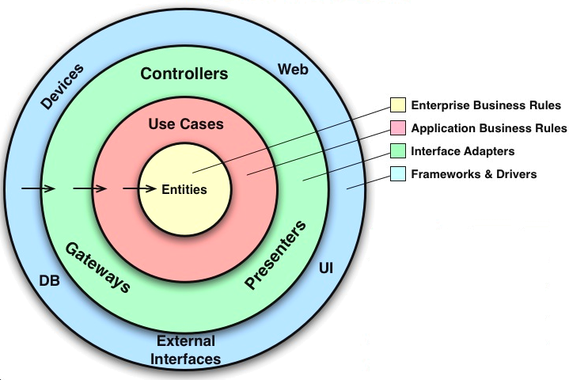
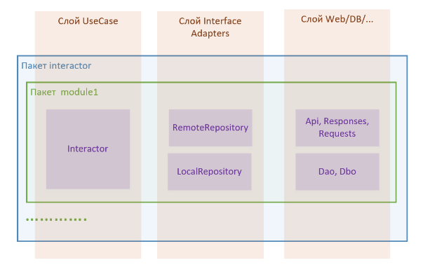
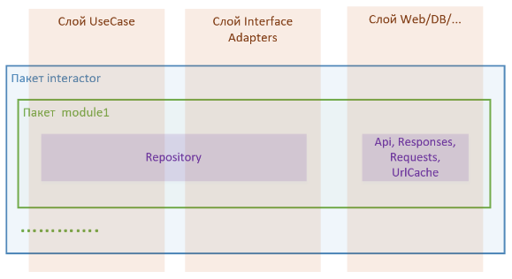
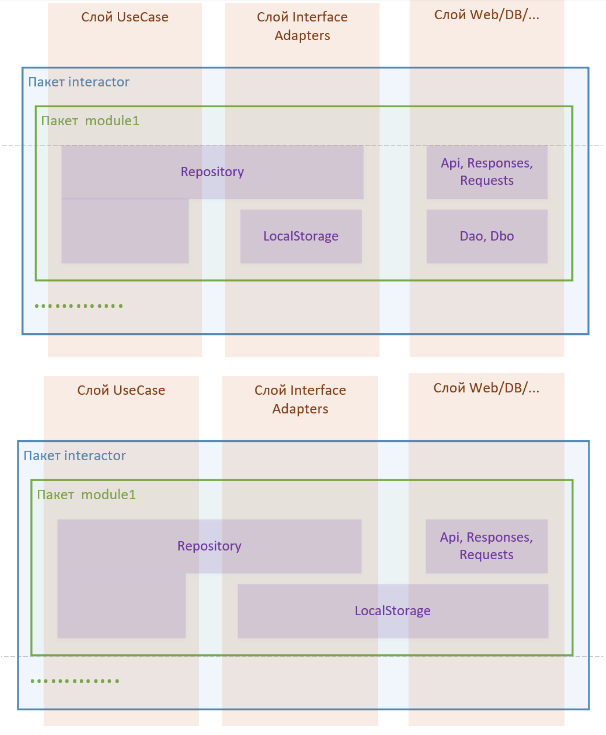
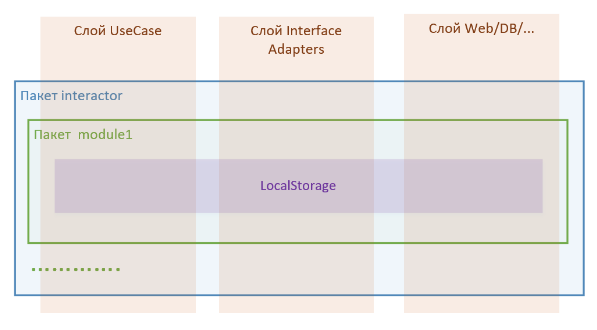
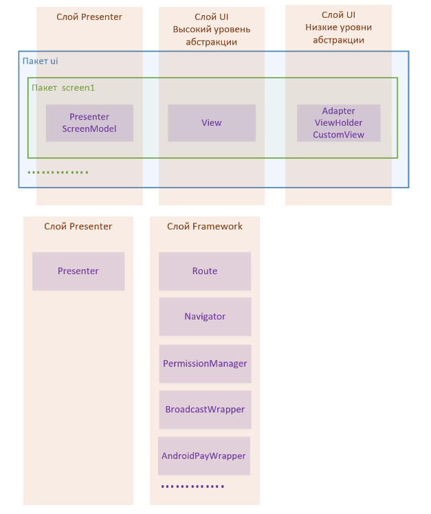

# **Общие требования к коду и архитектуре**

1. [DRY, SOLID, KISS, YAGNI](#dry-solid-kiss-yagni)
1. [Управление сложностью](#управление-сложностью)
1. [Принцип единой ответственности (S in SOLID)](#принцип-единой-ответственности-s-in-solid)
1. [Уровни абстракции](#уровни-абстракции)
1. [Архитектура](#архитектура)
1. [Структура и принадлежность классов слоям](#структура-и-принадлежность-классов-слоям)
    1. [Слой app](#слой-app)
    1. [Слой domain](#слой-domain)
    1. [Слой interactor](#слой-interactor)
        1. [Пример модуля с разделением ответственностей, точно соответствующем архитектуре](#пример-модуля-с-разделением-ответственностей-точно-соответствующем-архитектуре)
        1. [Примеры модулей с совмещенными слоями](#примеры-модулей-с-совмещенными-слоями)
        1. [Взаимодействие между модулями](#взаимодействие-между-модулями)
        1. [Когда следует выделять логику в интерактор](#когда-следует-выделять-логику-в-интерактор)
    1. [Слой ui](#слой-ui)
1. [Что то здесь не так](#что-то-здесь-не-так)

## DRY, SOLID, KISS, YAGNI

В нашей работе мы стараемся следовать приведенным выше [принципам](http://www.stijit.com/web-tips/dry-kiss-solid-yagni).

## Управление сложностью

Управление сложностью должно являться главным техническим императивом каждого
разработчика. Если посмотреть в общем, то все ключевые технологии (к примеру ООП),
лучшие практики (те же SOLID, KISS, DRY), различные архитектурные шаблоны(MVC,
CleanArchitecture) создавались в том числе для того, чтобы уменьшать
сложность кода, и все это из-за способностей человеческого разума. Как бы
мы нам не было неприятно это осознавать, но человек ограничен и не может
понимать как работают системы любой сложности.

Отсюда и вытекают в том числе требования к иерархичности(слои абстракции) и
единственной ответственности элементов чтобы человек мог в один момент времени
продуктивно работать с одной небольшой и достаточно независимой
частью системы.

[С. Макконнелл “Совершенный код”](https://drive.google.com/file/d/0B9HiaK6QQBxKZndPcDBIVUhlb3c/view) Управление сложностью глава 5.2

## Принцип единой ответственности (S in SOLID)

Заключается в том, что все структурные элементы(модуль, пакет, класс, метод,
переменная, параметр метода и тд) должны иметь единственную зону ответственности.
Если таких зон нескольку данную структурную единицу нужно разделить.
Другими словами, если класс или метод чем-то занимается, то он должен
делать только это и ничего другого.

Признаки нарушения единой ответственности:

- **And** в названии метода. Скорее всего этот метод выполняет несколько действий.
Например метод searchAndDestroy(Object o) скорей всего стоит разделить на
2 search(Object o) и destroy(Object o). Но, в этом случае возникает резонный
вопрос: “Что делать, если эти методы должны вызываться в нескольких местах
друг за другом. Дублирование же!”. В таком случае стоит их выделить более
высокий уровень абстракции, который выполняет вполне определенную задачу с
объектом;

- **Data class** содержащий в себе различные entity. Например, class Account
содержит (Имя, Фамилию, дату рождения,  серию и номер паспорта).
В таком случае стоит выделить пару классов Person(имя, фамилия, ДР) и
Passport(серия, номер паспорта) и инкапсулировать в Account;

- Отделение пустыми строками длинного метода.

## Уровни абстракции

*Примечание*. Этот раздел о выделении абстракции на низком уровне в рамках
одного класса.

Помимо разделения кода на функциональные части, необходимо разделять код на
различные уровни абстракции. Количество данных уровней зависит от сложности
и объема задачи к которой это разделение применяется.
Один уровень абстракции определяет примерно один уровень детализации.
Если рассматривать неприватные методы класса, образующие его интерфейс,
то они должны быть максимально возможно абстрагированы, в них не должна
отображаться внутренняя реализация. Эти неприватные методы в свою очередь
должны состоять из приватных методов понижающих уровень абстракции, они же
в свою очередь состоят из других приватных методов одного уровня понижающих
абстракцию и так далее.

[**Пример**](https://gist.github.com/icebail/aab425a46efab03a1024df5dbc553763)

Выделение уровней абстракций в коде позволяет человеку работающему с кодом
быстрее в нем разобраться, вникая в детали реализации до необходимого уровня.

Хотя в этом разделе раскрыта тема о выделении абстракци на низком уровне
в рамках одного класса эти принципы следует применять и для всех уровней:
 jar(aar) библиотека - пакет - подпакеты - класс - и тд.

При обсуждении уровней абстракции следует также вспомнить *принцип инверсии
зависимостей(D in SOLID)* - `модули верхних уровней не должны зависеть от
модулей нижних уровней`.

## Архитектура

Архитектуру, которую мы используем основана на принципах CleanArchitecture.

Основной ее особенностью является строгое разделение на слои(каждый со
своей областью ответственности) и направление зависимостей между слоями -
слои верхних уровней не должны зависеть от слоев нижних уровней.

Стрелками показаны направления зависимостей
1. Entities - бизнес обьекты приложения
1. UseCases - юзкейсы приложения (например, авторизация, с сохранением сессии;
получение профиля пользователя; изменение региона/вылюты)
1. InterfaceAdapters
    1. Gateways - обертки над сервером, базой данных и тд, которые конвертируют
данные из низкоуровневого источника в
данные для удобного использования в UseCase (в основном модели Entity)
    1. Presenter - Управляет отображением, конвертирует данные полученные от
слоя UseCase в структуру, подходящую для UI.
И наоборот: конвертирует данные и события от UI в подходящие для слоя UseCase.
UI условно можно разделить на 2 части: ввод и вывод.
Соответственно презентер также отвечает за обработку ввода с UI и
конфигурирования UI чтобы он выводил правильные данные.

1. Frameworks and Drivers
    1. UI - отвечает за взаимодействие с пользователем
    1. DB, Web, Framework… - Api сервера, базы данных, сервисы и тд.

Уровень абстракции данных и команд с помощью которых взаимодействуют слои
возрастает с приближением к центру.

На самом деле это только общая структура приложения и по разным направлениям
диаграммы может быть различное количество слоев, количество слоев зависит от
сложности системы - чем сложнее система, тем на большее количество подсистем
ее нужно разделить для уменьшения сложности не забывая при этом про соблюдение
иерархичности (уровней абстракции). UseCase и Gateways объединены в один слой,
это сделано потому что иначе для некоторых приложений сущность из UseCase просто
пробрасывала бы вызовы к сущности из Gateways.

Эта архитектура может быть в некоторых случаях упрощена так что UseCase и
Interface Adapter объединяются, в некоторых приложениях они называются Репозитории.

Также очень важным правилом в нашей архитектуре является деление каждого слоя
на небольшие практически независимые модули со строго определенными ответственностями
(деление на экраны, [модули с внутренней логикой](https://bitbucket.org/surfstudio/android-standard/wiki/Modules)).

Для более глубокого понимания следует ознакомиться со следующей
[хорошей статьей](https://habr.com/company/mobileup/blog/335382/).

## Структура и принадлежность классов слоям

Структура , используемая в проектах является гибридной, с одной стороны
она позволяет разделить классы по некоторым слоям, с другой по фичам.

Основные слои проекта (названия могут отличаться для разных проектов):
- [*app*](#слой-app)
- [*domain*](#слой-domain)
- [*interactor*](#слой-interactor)
- [*ui*](#слой-ui)

### Слой app
Содержит ключевые классы инфраструктуры приложения. В большинстве случаев
классы из этого пакета не изменяются во время разработки приложения.

### Слой domain
Соответствует слою entity и содержит бизнес объекты приложения
(например, Product, Profile, Order...)

### Слой interactor
Содержит модули с внутренней логикой приложения. Каждый модуль имеет
единственную ответственность, например: сервис получения геолокации,
хранилище продуктов, хранилище акций, сервис авторизации...
Соответствует слоям UseCase, Interface Adapters, Web/BD/Framework…
Иногда все эти слои вместе мы называем слоем Interactor, поскольку граница
между ними может быть размыта (см ниже).

#### Пример модуля с разделением ответственностей, точно соответствующем архитектуре

 - Api, Responses, Requests - классы, определяющие интерфейс для Retrofit
 - Dao, Dbo - низкоуровневые классы базы данных, Dbo - DataBase Object
 - RemoteRepository - обертка над Api, Responses, Request. Производит
 конвертацию входных параметров в Requests и преобразование ответов сервера
 (Responses) в сущности слоя Entity.
 - LocalRepository - обертка над Dao, Dbo. Производит конвертацию Entity
 моделей в Dbo и наоборот.  LocalRepostory может быть совмещен с Dao,
 если у Dao будет интерфейс, соответствующий уровню абстракции слоя
 InterfaceAdapters.
 - Interactor - может содержать следующую логику:
    * данные, полученные из RemoteRepository отдает на сохранение в LocalRepository
    * в случае ошибки получения данных из RemoteRepository отдает данные из LocalRepository
    * может позволять подписываться на изменения какой либо сущности
      (например с помощью PublishSubject)
    * ....

#### Примеры модулей с совмещенными слоями
В следующем случае логики для UseCase практически нет, и он просто должен
пробрасывать вызов в Interface Adapters

В следующих случаях логики немного больше но ее все равно недостаточно
для выделения дополнительной сущности:

Если необходимо реализовать простое локальное хранилище (например хранилище
настроек приложения) в котором практически логики, то оно может выглядеть так:

Сущность, которая относится к нескольким слоям должна иметь публичный интерфейс,
соответствующий уровню абстракции самого высшего из обьединенных слоев.

#### Взаимодействие между модулями

Хотя и следует стремиться чтобы модули были максимально независимыми,
в реальных проектах это не всегда получается. В этом случае следует пользоваться
вышеприведенными принципами построения архитектуры и здравым смыслом, чтобы
максимально уменьшить связанность кода и снизить к минимуму количество связей
и side эффектов. Наиболее предпочтительным способом является взаимодействие
через интерактор, поскольку логика связывания различных модулей относится
именно к слою UseCase. Еще следует придерживаться такого правила: чем в более
низшем слое находится класс, тем меньше должна быть вероятность найти в нем
зависимость от класса другого модуля и обратно - от этого класса не должны
зависеть другие модули.

#### Когда следует выделять логику в интерактор

Хорошими индикаторами того, что репозиторий содержит логику слоя UseCase являются
 - наличие .doOnNext() и .flatMap() на цепочках Observable
 - наличие Subject в самом репозитории

Если методов с этой логикой больше четверти от всего числа методов, пора
обзавестись интерактором. Причем интерактор должен оборачивать все
публичные методы репозитория, а сам репозиторий должен использоваться
только в интеракторе.

### Слой ui

Отвечает за логику и отображение ui.
Соответствует слоям Presenter, UI/Framework…
Иногда эти слои вместе мы называем ui слоем.

Принадлежность классов экрана к слоям:

## Что-то здесь не так
Вы можете сказать, что изначально говорилось про принцип инверсии зависимостей
и то что слои высшего уровня не должны зависеть от слоев низших уровней,
а при реализации например интерактора он должен содержать в себе ссылки на
LocalRepository и RemoteRepository.

И вы будете абсолютно правы, это нарушение архитектуры, но оно решается
очень просто: если у сущности каждого слоя выделить интерфейс и перенести
его в более высший слой то проблема будет решена. Например:
* Интерфейс View относится к слою Presenter
* Интерфейс LocalRepository относится к слою UseCase
* ....

Мы же этого не делаем поскольку:
* На разработку и поддержку такого кода нужно больше времени
* Если публичный интерфейс класса такой же как и интерфейс, который он реализует,
то переменные типа этого класса и типа интерфейса для той сущности,
которая будет использовать эту переменную, будут абсолютно равнозначны.

Хотя публичный интерфейс конкретного класса View содержит методы фреймворка
(пр. getResources()) мы все равно не выделяем для нее интерфейс,
а проблему использования этих методов в презентере решаем строгим правилом,
прописанным в Технической Документации и внутренней дисциплиной.

Однако это не означает что интерфейсы вообще не нужны. Интерфейсы, к примеру,
можно использовать чтобы подменять реализацию модуля в Runtime.
